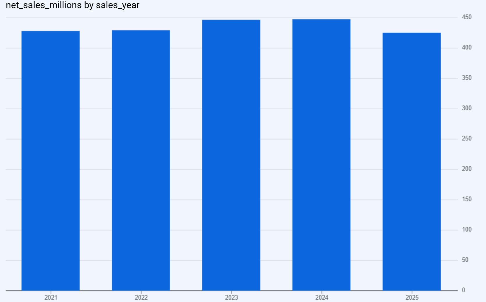
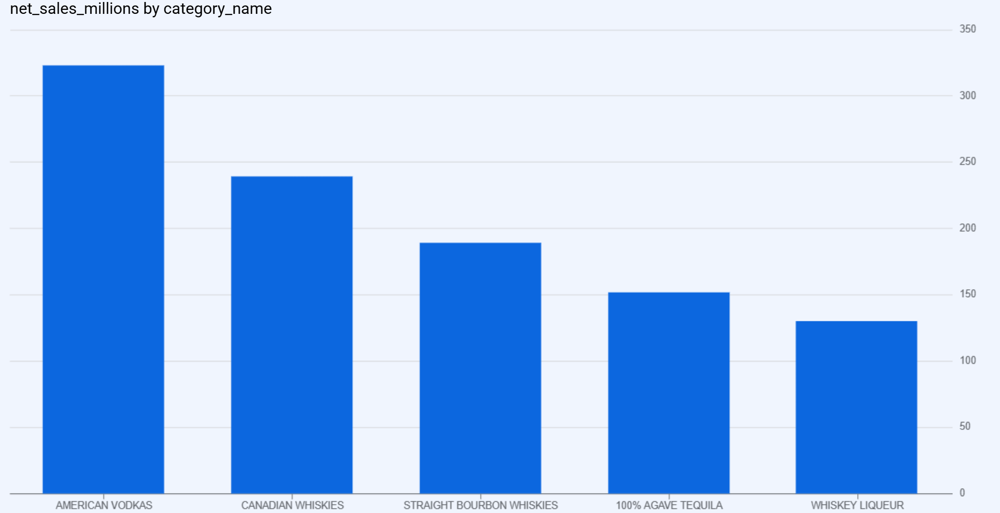
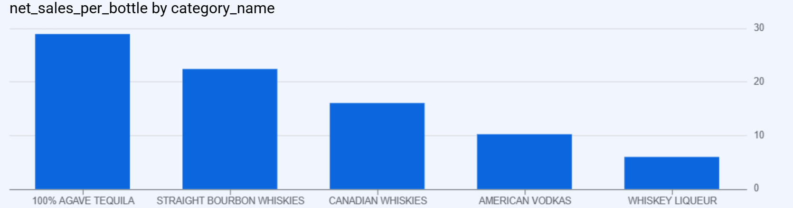

# Iowa Liquor Sales SQL Analysis

## Project Overview

This SQL portfolio project analyzes wholesale liquor purchases by licensed Iowa retailers from 2021 to 2025 using Google BigQuery. The analysis covers 12,908,429 transaction records and examines sales trends, leading categories and products, geographic performance, store performance, and sales value per bottle.

[Read the full case study (PDF)](Documentation/Iowa_Liquor_Sales_SQL_Case_Study.pdf)

📄 [View the One-Page Executive Summary](Documentation/Iowa_Liquor_Sales_Executive_Summary.pdf)

## Project Objective

The objective is to transform a large public sales dataset into clear business insights by:

- Evaluating annual and monthly sales performance
- Identifying leading liquor categories and products
- Comparing sales across counties and stores
- Measuring sales value per bottle
- Checking important data-quality issues before analysis

## Tools and Data Scope

- **Database:** Google BigQuery
- **Language:** GoogleSQL
- **Analysis period:** 2021–2025
- **Records analyzed:** 12,908,429
- **Analysis view:** `vw_sales_2021_2025`
- **Main outputs:** SQL queries, result screenshots, visualizations, and case-study documentation

## Analysis Workflow

1. Reviewed the dataset structure, date coverage, and column data types.
2. Checked missing values, zero values, negative transactions, and pricing fields.
3. Created a reusable analysis view containing the required columns and the 2021–2025 date range.
4. Analyzed annual trends, monthly trends, categories, products, counties, stores, and sales value per bottle.
5. Documented the findings and created supporting screenshots and visualizations.

## Key Findings

- Annual sales increased from **$428.12 million in 2021** to a peak of **$447.24 million in 2024**, before declining to **$424.99 million in 2025**.
- Active stores increased from **1,948 in 2021** to **2,243 in 2025**, showing broader market participation.
- **American Vodkas** was the leading category, generating **$323.38 million** in sales during the analysis period.
- Multiple variants of **Tito's Handmade Vodka** appeared among the highest-selling individual products.
- **Polk County** led geographic performance with **$505.92 million** in sales, substantially ahead of other counties.
- Among the five selected leading categories, **100% Agave Tequila** generated the highest net sales value per bottle at **$29.00**, followed by Straight Bourbon Whiskies at **$22.33**. This measure reflects product and bottle-size mix; it is not a profit measure.
- Data-quality checks identified **4 missing vendor numbers** and **48 zero retail-price records**. The case study documents these and other quality checks and their treatment.
- The **10,144 negative sales records** also had negative bottle quantities, and were retained as likely returns or corrections. Their transaction type was not independently confirmed.

## Recommendations

- Investigate the 2025 sales decline and compare it with product availability, customer demand, and market conditions.
- Maintain strong inventory support for American Vodkas while monitoring performance of categories with higher sales value per bottle, such as tequila and bourbon.
- Prioritize Polk County as a key market while identifying opportunities to expand sales in other high-performing counties.
- Review leading product variants and store-level performance to support inventory planning and sales strategies.
- Continue monitoring missing vendor details, zero retail prices, and negative return transactions as part of routine data-quality checks.

## Visualizations

### Annual Sales Performance

### Top 5 Categories by Sales

### Sales Value per Bottle

## Project Structure

- `SQL/`
  - `01_data_profiling_and_quality.sql` — Queries 01–12
  - `02_create_analysis_view.sql` — Queries 13–14
  - `03_business_analysis.sql` — Queries 15–22
- `Documentation/` — PDF case study: `Iowa_Liquor_Sales_SQL_Case_Study.pdf`
- `Screenshots/` — Six key BigQuery result screenshots
- `Visualizations/` — Three selected analysis charts
- `README.md` — Project summary, findings, and recommendations
- `LICENSE.txt` — Project license information

## Dataset Source and Permitted Use

- **Source table:** `bigquery-public-data.iowa_liquor_sales.sales`
- **Original publisher:** State of Iowa
- **Access method:** Google Cloud BigQuery Public Dataset Program
- **Usage:** The publicly accessible dataset was used for educational and portfolio analysis.
- This repository contains SQL queries and derived analytical outputs; it does not redistribute the complete raw dataset.
- Ownership of the source data remains with the original publisher, and users should review the source terms before further reuse.

For more information, see the [BigQuery Public Datasets documentation](https://cloud.google.com/bigquery/public-data).
